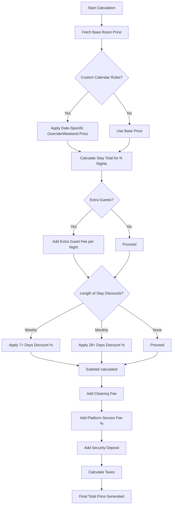
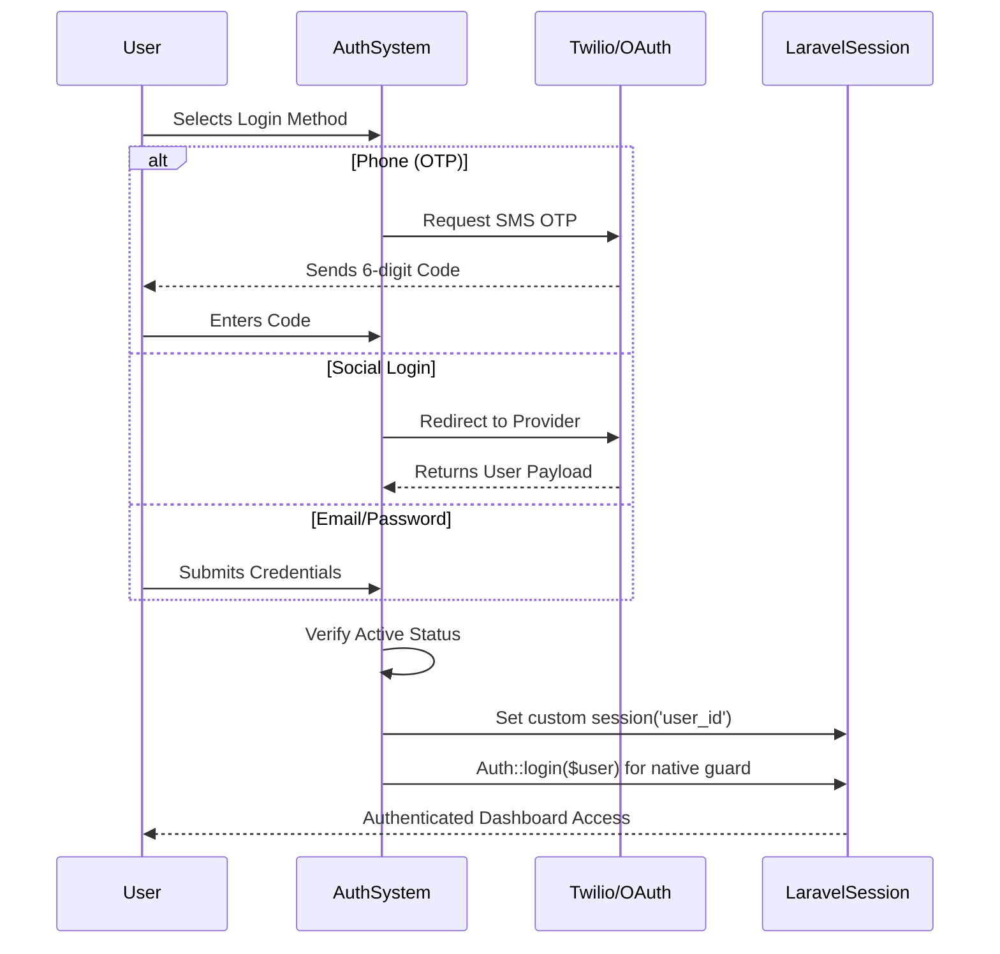
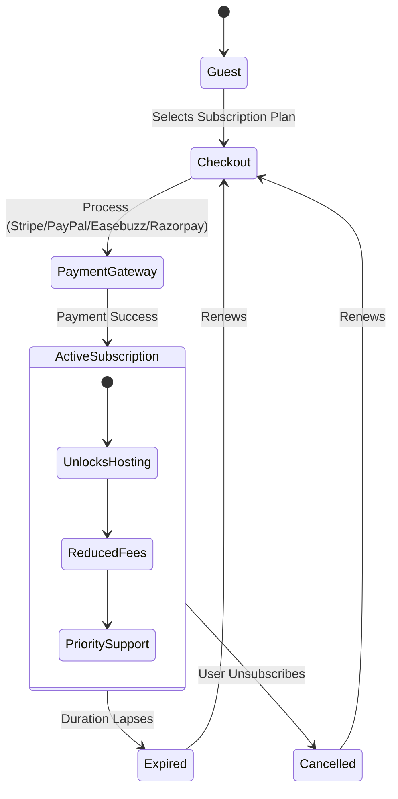
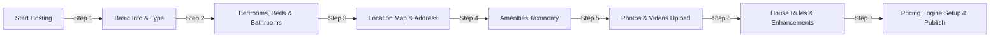

<div align="center">
  
  <h1>🏨 Hotel Host Platform</h1>
  <p><strong>A fully-featured, modern accommodation booking and hosting platform built with Laravel.</strong></p>

  <p>
    
    
    
    
  </p>
</div>

<hr>

## 🌟 Overview

**Hotel Host** is a comprehensive, multi-tenant marketplace connecting property owners (Hosts) with travelers (Guests). The platform is architected to handle complex operational flows including dynamic pricing algorithms, subscription-based hosting tiers, granular dynamic settings, and multi-gateway payment processing.

Featuring a beautiful, responsive user interface with **built-in Dark Mode**, the application is engineered for performance, security, and scalability.

---

## 🏗️ Deep Dive: Core System Concepts & Flows

### 1. The Dynamic Pricing Engine
The booking calculation engine is highly dynamic, processing multiple layers of rules to calculate the final price in real-time. This ensures hosts can maximize revenue based on seasonality, guest count, and length of stay.



### 2. Multi-Channel Authentication & Session Flow
The platform moves beyond standard Laravel Auth, implementing a highly modular authentication flow. It supports direct credential logins, passwordless OTP (Twilio), and OAuth (Google, Facebook, Apple).



### 3. The Host Subscription Lifecycle
To list properties, users can upgrade to Host status via a tiered subscription model. The system tracks subscription states, duration limits, and automatic capability revoking upon expiration.



### 4. Interactive Property Listing Pipeline
Creating a listing is a massive data-entry task. Hotel Host breaks this down into a highly modular, interactive 7-step wizard that saves progress asynchronously.



### 5. Dynamic Configuration System (Admin)
The platform is built to be manageable without code changes. Admins control a unified "Settings" JSON/Database architecture.

* **Payment Toggles:** Turn Stripe, PayPal, Razorpay, or Easebuzz on/off instantly. If disabled, they hide from the UI.
* **Social Auth Toggles:** Enable or disable Apple, Google, or Facebook login.
* **Feature Toggles:** Turn Twilio SMS or Google reCAPTCHA on/off dynamically. The app seamlessly falls back to local processing (e.g. dummy OTPs) if APIs are disabled.

---

## 🚀 Core Features by Role

### 👤 For Guests
- **Smart Search & Discovery**: Browse destinations, filter by amenities, price, and property types.
- **Wishlists & Grouping**: Save and categorize favorite properties into custom folders.
- **Trip Management**: View detailed itineraries, download PDF receipts, and manage upcoming reservations.

### 🏠 For Hosts
- **Calendar Management**: Block out dates, set custom prices for holidays, or make dates unavailable.
- **Earnings Tracking**: Monitor revenue minus platform fees (which dynamically reduce if the host is on a premium subscription).
- **Property Enhancements**: Upsell guests on extra features (e.g., airport pickup, extra cleaning).

### 🛡️ For Administrators
- **Centralized Dashboard**: Complete oversight over users, properties, and revenue.
- **Taxonomy Management**: Create and manage Property Types, Space Types, and global Amenities dynamically.
- **Subscription Management**: Configure host subscription tiers, pricing, and capability limits.

---

## 🛠️ Technology Stack

| Category | Technologies |
|----------|-------------|
| **Backend Framework** | Laravel 11.x, PHP 8.2+ |
| **Database** | MySQL, Eloquent ORM |
| **Frontend Rendering**| Blade Templates, Vanilla CSS (Design System) |
| **State & Interactivity**| Vanilla JavaScript, AJAX Fetch API |
| **Authentication** | Laravel Auth, Custom Session Sync, Laravel Socialite |
| **APIs/Services**| Twilio (SMS), Google Maps, reCAPTCHA v3 |

---

## 🎨 UI/UX Philosophy
- **Glassmorphism & Gradients**: Modern aesthetic utilizing subtle shadows, frosted glass effects, and vibrant gradient accents to convey a premium feel.
- **First-Class Theme Support**: Deep integration for Light and Dark modes, utilizing CSS custom properties for instant toggling without page reloads.
- **Micro-interactions**: Hover states, smooth transitions, and elegant CSS tooltips guide user behavior without cluttering the interface.

---

## ⚙️ Local Development Setup

1. **Clone the repository:**
   ```bash
   git clone <repository-url>
   cd CRUD-APP
   ```

2. **Install PHP dependencies:**
   ```bash
   composer install
   ```

3. **Environment Configuration:**
   ```bash
   cp .env.example .env
   php artisan key:generate
   ```
   *Update your `.env` file with your database credentials and API keys (Stripe, Twilio, etc).*

4. **Run Migrations & Seeders:**
   ```bash
   php artisan migrate --seed
   ```

5. **Link Storage:**
   ```bash
   php artisan storage:link
   ```

6. **Start the Development Server:**
   ```bash
   php artisan serve
   ```
   *Visit `http://localhost:8000` in your browser.*

---
<div align="center">
  <p>Built with ❤️ using Laravel</p>
</div>
